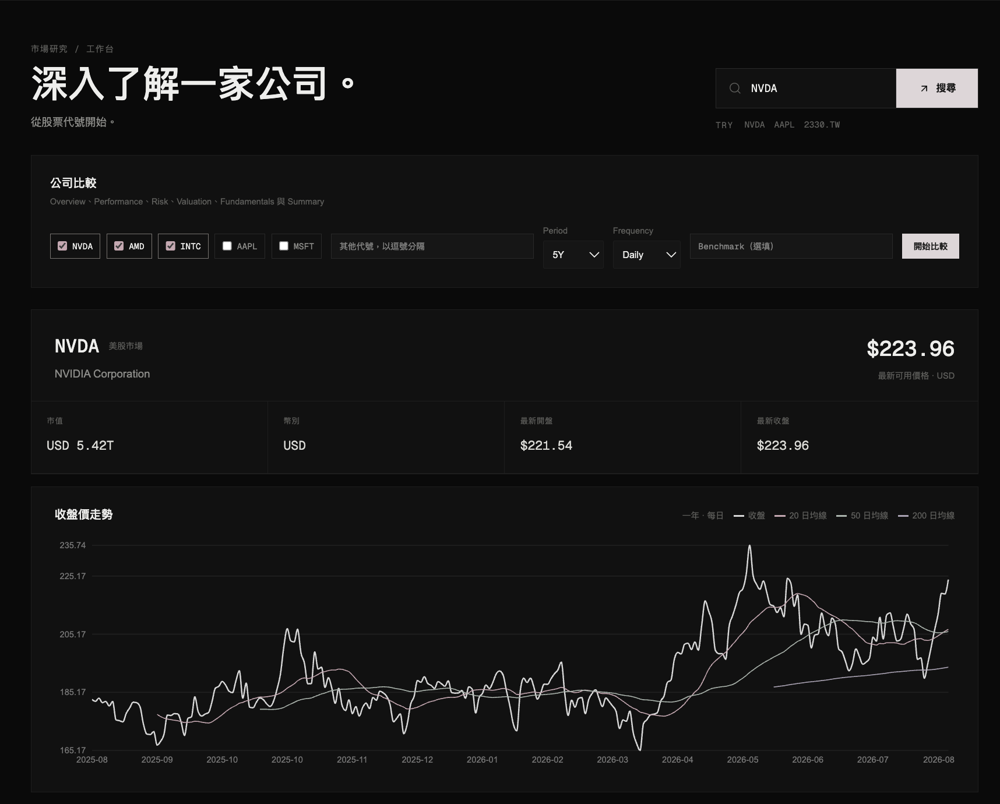
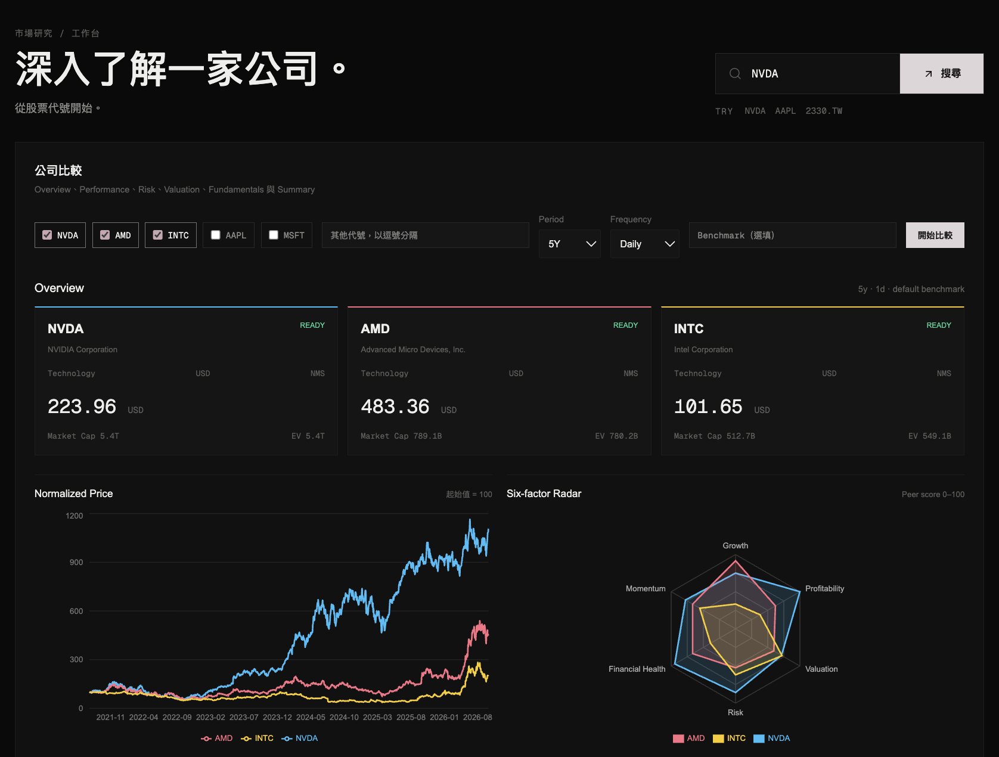
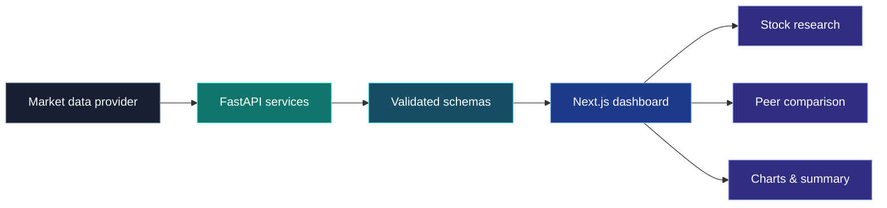
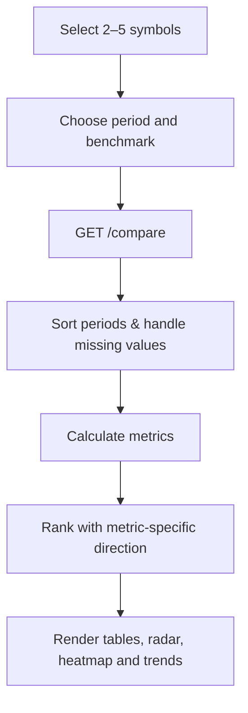

# FinSight

Market data, fundamentals and peer comparison in one focused investment research workspace.


FinSight turns raw market data into readable research signals with transparent calculations, peer-relative scoring and focused visualizations.

## Demo

### Stock research workspace

查詢股票後，可以在同一個工作區查看價格走勢、市場統計、量化分析、基本面與新聞。



### Peer comparison

比較 2–5 家公司，查看 normalized price、six-factor radar、財務指標表與 raw-value heatmap。



## Features

| Area                      | Functionality                                                                         |
| ------------------------- | ------------------------------------------------------------------------------------- |
| **Market view**     | Price history, returns, volatility, beta, alpha, volume and benchmark comparison      |
| **Fundamentals**    | Revenue, EPS, margins, ROIC, free cash flow, liquidity and valuation metrics          |
| **Peer comparison** | Compare 2–5 companies across Performance, Risk, Valuation and Fundamentals           |
| **Research layer**  | Configurable ranking direction, null-safe percentile scores and deterministic summary |
| **Charts**          | Chronological trends, normalized price, radar comparison and indexed revenue growth   |

### Calculation guardrails

- 財務期間在繪圖前會依時間由舊到新排序。
- 每個 metric 可設定由大到小或由小到大的排名方向。
- `null`、`undefined` 與 `NaN` 不會參與 percentile ranking。
- 負 EPS 不會產生誤導性的 P/E。
- 缺少資料不會被靜默轉換成 `0`。
- Heatmap 同時顯示 percentile score 與原始值。

## Figures

### Data flow



### Comparison workflow



## Quick start

### Requirements

- Python 3.12+
- [`uv`](https://docs.astral.sh/uv/)
- Node.js 20+
- npm

### Start the backend

```bash
cd backend
cp .env.example .env
uv sync
uv run uvicorn app.main:app --reload
```

API: [http://127.0.0.1:8000](http://127.0.0.1:8000)
OpenAPI docs: [http://127.0.0.1:8000/docs](http://127.0.0.1:8000/docs)

### Start the frontend

```bash
cd frontend
npm install
npm run dev
```

Dashboard: [http://localhost:3000](http://localhost:3000)

If the backend runs elsewhere:

```bash
NEXT_PUBLIC_API_URL=http://127.0.0.1:8000
```

## API endpoints

| Method  | Endpoint                          | Purpose                           |
| ------- | --------------------------------- | --------------------------------- |
| `GET` | `/`                             | Health check                      |
| `GET` | `/stocks/{symbol}`              | Stock profile and price history   |
| `GET` | `/stocks/{symbol}/news`         | Recent company news               |
| `GET` | `/stocks/{symbol}/analytics`    | Quantitative analytics            |
| `GET` | `/stocks/{symbol}/fundamentals` | Fundamental metrics               |
| `GET` | `/compare`                      | Multi-company comparison          |
| `GET` | `/docs`                         | Interactive OpenAPI documentation |

Example:

```bash
curl "http://127.0.0.1:8000/compare?symbols=NVDA,AMD,INTC&period=5y&frequency=1d"
```

## Architecture

FinSight is split into a small API layer, a focused dashboard layer and testable calculation services.

### Repository structure

```text
finsight/
├── backend/
│   ├── app/
│   │   ├── main.py
│   │   ├── schemas/
│   │   │   ├── __init__.py
│   │   │   ├── analytics.py
│   │   │   ├── comparison.py
│   │   │   ├── fundamentals.py
│   │   │   ├── metrics.py
│   │   │   ├── news.py
│   │   │   └── stock.py
│   │   └── services/
│   │       ├── __init__.py
│   │       ├── analytics_service.py
│   │       ├── comparison_service.py
│   │       ├── fundamentals_service.py
│   │       ├── news_service.py
│   │       ├── research_service.py
│   │       └── stock_service.py
│   ├── tests/
│   │   ├── test_comparison_api.py
│   │   ├── test_financial_calculations.py
│   │   ├── test_research_service.py
│   │   └── test_stocks_api.py
│   ├── pyproject.toml
│   └── uv.lock
├── frontend/
│   ├── app/
│   │   ├── favicon.ico
│   │   ├── globals.css
│   │   ├── layout.tsx
│   │   └── page.tsx
│   ├── components/
│   │   ├── comparison/
│   │   │   ├── ComparisonCharts.tsx
│   │   │   ├── ComparisonSections.tsx
│   │   │   ├── config.ts
│   │   │   └── formatters.ts
│   │   ├── ComparisonDashboard.tsx
│   │   ├── FundamentalCharts.tsx
│   │   ├── NewsTimeline.tsx
│   │   └── PriceChart.tsx
│   ├── lib/
│   │   └── api.ts
│   ├── eslint.config.mjs
│   ├── next.config.ts
│   ├── package.json
│   ├── package-lock.json
│   ├── postcss.config.mjs
│   └── tsconfig.json
├── docs/
│   └── images/
│       ├── comparison-demo.png
│       └── stock-detail-demo.png
└── README.md
```

| Directory                           | Responsibility                         |
| ----------------------------------- | -------------------------------------- |
| `backend/app/schemas/`            | Typed API response models              |
| `backend/app/services/`           | Data access and financial calculations |
| `backend/tests/`                  | API, ranking and formula tests         |
| `frontend/components/comparison/` | Peer comparison charts and sections    |
| `docs/images/`                    | README demo screenshots                |

## Verification

```bash
cd backend
uv run pytest
uv run ruff check app tests
uv run ruff format --check app tests

cd ../frontend
npm run lint
npm run build
```

Current verification: **32 backend tests passing**, Ruff checks passing, frontend lint passing and production build passing.

## Data note

FinSight uses market and financial data from upstream providers through `yfinance`. Data may be delayed, incomplete or temporarily unavailable. This project is for research and visualization, not financial advice.

## Project files

- Roadmap: [`FinSight_Roadmap.md`](./FinSight_Roadmap.md)
- Engineering record: [`Record.md`](./Record.md)
- Demo images: [`docs/images/`](./docs/images/)

## License

No license has been declared yet.
